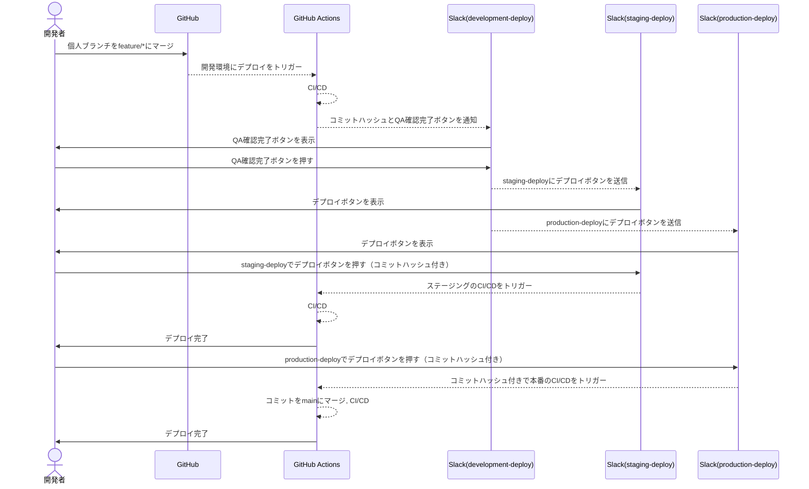

こんにちは！営業製作所でエンジニアをやっている秋山です 🍔

本記事では、GitHub Enterprise を使用せずに、効率的かつ安全な承認制デプロイを構築する方法について解説します。
弊社プロダクトで実際に GitHub Enterprise を使用せずにデプロイ承認制を実現するにあたって、デプロイフローを改善した事例を紹介します。

# 背景と目的

現状のデプロイフローでも運用できていましたが、改善すべき点があり、
プロダクトのフェーズ的にも本格運用が始まるため、次の 2 点を改善する必要がありました。

- **誰でもデプロイできる**
  - GitHub Enterprise ではないためデプロイを承認制にすることができない
    ->**デプロイを承認制にしたい！！！**
- **`docker image`が開発環境, ステージング環境, 本番環境でバラバラ**
  - image を各環境で分ける必要がないため
  - ビルドが不要になるためデプロイまでの時間も減りコスト削減ができてハッピー
    ->**image を使い回したい！！！**

このような背景がありデプロイフローの改善を試みました。

# デプロイを承認制にしたい

現状、誰でもデプロイが可能な状態であるため、承認制にして限られた人にしかデプロイできないようにしたい。
ただ、弊社の GitHub プランは Enterprise ではないため承認制のデプロイが使えません。

そこで活用したのが**Slack のチャンネル**です。

## Slack を活用して承認デプロイを実現

**どうやって Slack を使ってデプロイを承認制にするのか？？**

Slack を活用してデプロイできる人を限定的にします。
具体的には、各環境へのデプロイ用チャンネルを作成し、そこからしかデプロイできないようにします。

- ステージングデプロイ用チャンネル
- 本番デプロイ用チャンネル

この 2 つのチャンネルを作成し、権限がある人のみがチャンネルに属せます。
それぞれのチャンネルから**デプロイボタンを押したら GitHub Actions が実行されるようにします。**

Slack のチャンネルを利用した承認デプロイの流れはこちらになります。
:::message

1. 開発環境へデプロイ完了
2. Slack の開発環境デプロイ完了通知用チャンネルに通知
3. デプロイ完了した旨と「QA 確認 OK」ボタンを一緒に
4. 開発環境で QA 確認まで完了させる
5. 「QA 確認 OK」ボタンを押す
6. **ステージングデプロイ用チャンネル、本番環境デプロイ用チャンネルにデプロイボタン付きメッセージが送信される**
7. それぞれのチャンネルでデプロイボタンを押下する
   :::

## 実現するために必要なこと

デフォルトで Slack に用意されている機能では次の 2 つが実現できません。

- GitHub Actions を起動させること
- 2 つのチャンネルに同時に通知を送ること

先述したフローに当てはめると**6, 7 番目にあたるステップ**がカスタムファンクションを使わないと実現できない機能になります。

> 1. 開発環境へデプロイ完了
> 2. slack の開発環境デプロイ完了通知用チャンネルに通知
>    デプロイ完了した旨と「QA 確認 OK」ボタンを一緒に
> 3. 開発環境で QA 確認まで完了させる
> 4. 「QA 確認 OK」ボタンを押す
> 5. ステージングデプロイ用チャンネル, 本番環境デプロイ用チャンネルにデプロイボタン付きメッセージが送信される
> 6. それぞれのチャンネルでデプロイボタンを押下する

そこで利用したのが**Slack Custom Function**です。
:::message
Slack Custom Function は、Slack のワークスペース内で特定のタスクを自動化したり、特定のアクションをトリガーしたりするためのカスタムコードを実行するための機能です。これにより、Slack のメッセージやイベントに応じて特定の動作を自動的に行うことができます。
:::

実際に作成したカスタムファンクションはこちらから参照することができます。
↓↓↓↓↓↓↓
https://github.com/eigyo-mfg/slack-deployment-approval-flow

# Docker イメージを全環境で使い回したい

弊社プロダクトは開発環境、ステージング環境、本番環境でそれぞれ Docker イメージをビルドしデプロイしていました。

ただ、それぞれの環境でビルドすると次のようなデメリットがあります。
:::message alert
**各環境でビルドする -> イメージの数が増える -> ECR の料金が増える**
**各環境でビルドする -> GitHub Actions の実行時間が長くなる**
:::

Docker イメージを使い回すことでこのような問題が解消できるようになります 🙌

## どのようにイメージを使い回すのか？

では、どのようにして Docker イメージを使い回すのか説明していきます。
それは共通の各環境で共通の ECR を用意します。

弊社の AWS アカウントは下記のように分けています。

- 開発環境用アカウント
- ステージング環境用アカウント
- 本番環境用アカウント
- ECR 管理用アカウント

1. 開発環境 CI/CD で Docker イメージをビルド, プッシュ
   ※イメージのタグをコミットハッシュにする
2. ステージング, 本番デプロイ時に 1.のコミットハッシュを渡す
3. コミットハッシュから 1.でビルドした Docker イメージを参照しタスクを作成して ECS を更新する

これで Docker イメージを使い回すことができます 👏

:::message
ポイントは次の 2 点

- **ECR 管理用の AWS アカウントを用意する**
- **Docker イメージのタグをコミットハッシュにする**
  :::

# 最終的なデプロイ承認フロー

ここまでの内容をもとにデプロイ承認フローを実現したものを紹介します。

## ブランチ構成

- `main`
- `feature/*`

## デプロイフロー

少し長くなりますが一連の流れはこちらになります。

1. feature/\*ブランチに個人ブランチをマージ
2. 開発環境 GitHub Actions 起動（Docker イメージビルド、デプロイ）
3. 開発環境デプロイ通知チャンネルに通知
4. 開発環境で QA 確認
5. 開発環境デプロイ通知チャンネルで「QA 確認完了」ボタンを押す
6. ステージングデプロイ用チャンネル、本番デプロイ用チャンネルに通知
7. ステージングデプロイ用チャンネルでデプロイボタンを押す
8. ステージング環境 GitHub Actions 起動（デプロイ）
9. 本番デプロイ用チャンネルでデプロイボタンを押す
10. 本番環境 GitHub Actions 起動（main にマージ、デプロイ）

:::message
Docker イメージを使い回すために開発環境でビルドした時のコミットハッシュを本番環境デプロイが完了するまでリレーしていきます。
:::

シーケンス図に表すと次のようになります。

# まとめ

今回は Slack を活用して GitHub Enterprise にせずにデプロイフローを承認制にすることができ、限られた人だけがデプロイを行えるようになりました。
また、デプロイフローを見直すにあたって、Docker イメージを全環境で使い回すことで、効率的かつコストを抑えた運用が可能になりました 🎉

# エンジニア採用やってます

[営業製作所株式会社](<[リンクのURL](https://eigyo-mfg.com/)>)ではエンジニアを絶賛募集中です！
日本が誇る製造業をもう一度輝かせるという志に賛同いただけるエンジニアの方がいらっしゃったら、ぜひご応募ください！
それ以外でも話を聞いてみたいという方がいらっしゃいましたら、カジュアル面談だけでも構いませんので、どうぞお気軽にお声がけください！
https://eigyo-mfg.com/
